# esp8266_chirp_logger

Captures sensor data over SPI and sends it to InitialState.com.

### Example Serial output



```
🌐 ....
🌐 Connected to Velops
🌐 IP address: 192.168.10.249
📀 I2C FRAM... Found
📀 Restarted 207 times
🌱 Setup MCP9808.. OK
🌱 Setup BMP085.. OK
🌱 Setup chirp(s).. (1) (2) OK

🌱 ESP8266      Volts:  ⚡️3.35V         Reset reason:   ⏏5
🌱 BMP085       Temp:   🌡 23.30*C       Pressure:       🪂 1022.27 hPa
🌱 MCP9808      Temp:   🌡 24.75*C
🌱 chirp1       Temp:   🌡 26.00*C       Moist:  💧1015.0        Light:  ☀️ 796.0
🌱 chirp2       Temp:   🌡 25.00*C       Moist:  💧1013.0        Light:  ☀️ 816.0
📀 16   0324    1A00    F700    1C00    1900    F500    3000    0000

🔒 connecting to groker.init.st
🔐 secure connection made
🌐 URL: /api/events?accessKey=XXX&bucketKey=YYY&temp_c=24.75&temp_b=23.30&pressure_b=1022.27&temp_chirp1=26.00&light_chirp1=796.00&moisture_chirp1=1015.00&temp_chirp2=25.00&light_chirp2=816.00&moisture_chirp2=1013.00&vcc_volt=3.35&isSecure=1
🌐 Request sent 🚀
🌐 Response:
HTTP/1.1 204 No Content
🔐 Connection Closed

💻 CONT stack used: 2260
💻 BSSL stack used: 4372
-------

💤 Going to sleep for 49244ms
```