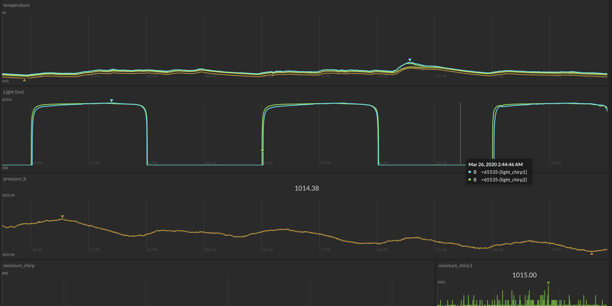

# esp8266_chirp_logger

Captures sensor data over SPI and sends it to InitialState.com.


### Initial State Dashboard



### Serial output


```
🌐 ....
🌐 Connected to [WIFI]
🌐 IP address: 192.168.10.249
📀 I2C FRAM... Found
📀 Restarted 207 times
🌱 Setup MCP9808.. OK
🌱 Setup BMP085.. OK
🌱 Setup chirp(s).. (1) (2) OK

🌱 ESP8266      Volts:  ⚡️3.35V         Reset reason:   ⏏5
🌱 BMP085       Temp:   🌡 23.30*C       Pressure:       🪂 1022.27 hPa
🌱 MCP9808      Temp:   🌡 24.75*C
🌱 chirp1       Temp:   🌡 26.00*C       Moist:  💧1015.0        Light:  ☀️ 796.0
🌱 chirp2       Temp:   🌡 25.00*C       Moist:  💧1013.0        Light:  ☀️ 816.0
📀 16   0324    1A00    F700    1C00    1900    F500    3000    0000

-------

💤 Going to sleep for 49244ms
```